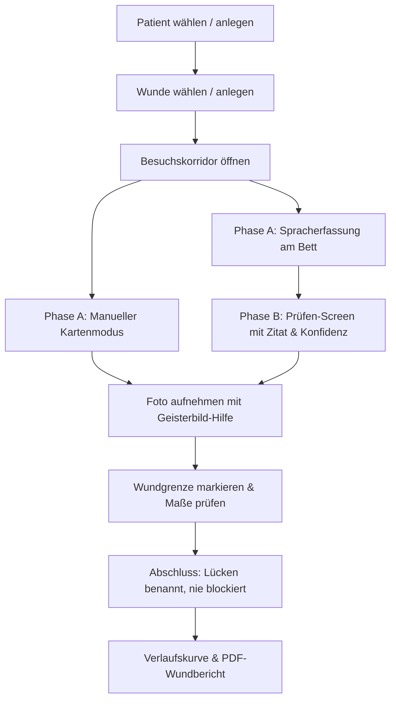

# Wunddoku — Ambulante Wunddokumentation

> **Konzeption und Realisierung einer feldtauglichen Flutter-App für die ambulante Wundversorgung im Auftrag von Schneider Prozessautomatik.**
> 
> Entwickelt mit starkem Fokus auf **UI/UX-Ergonomie unter Realbedingungen** (Handschuhbedienung, Einhand-Nutzung, Zeitdruck am Krankenbett), **klinische Genauigkeit** nach Primärquellen und **strikten Datenschutz nach Art. 9 DSGVO**.

---

## 📋 Überblick & Problemstellung

In der ambulanten Wundversorgung (z. B. 3–5 Patienten pro Tour in der Flotte eines Sanitätshauses) ist die Dokumentation ein wesentlicher Zeitfresser:
* **Bisheriger Ist-Zustand:** Notizen auf Papier oder unvollständige Stichpunkte vor Ort – gefolgt von 10–15 Minuten Nachdokumentation je Patient abends im Büro.
* **Ziel dieser App:** Vollständige, rechtssichere und belegte Erfassung **direkt am Ort des Geschehens** in unter 2 Minuten – ohne Tippen, fehlertolerant und offline-fähig.

---

## 📱 Kern-Workflow (Durchgehender Pfad in voller Tiefe)



1. **Patient & Wunde:** Übersicht mit offenen Besuchen, Wundstatus und Größenveränderung.
2. **Phase A (Am offenen Verband):** Schnelle Spracherfassung mit einem Daumentipp oder Stepper-Kartenmodus.
3. **Phase B (Handschuhe aus):** Strukturierte Prüfung der erkannten Werte mit wörtlichem Transkript-Zitat und gezielter Korrekturmöglichkeit.
4. **Foto & Markierung:** Foto-Sucher mit transparentem Geisterbild der Voraufnahme für reproduzierbare Perspektiven; Einzeichnen der Wundgrenze (Normalisierte Vektorgeometrie + eingebrannte Zweitdatei).
5. **Verlauf & Dokumentation:** Exakte Verlaufsdarstellung ohne verfälschende Interpolation, druckfertiger PDF-Wundbericht für den behandelnden Arzt.

---

## 🎨 UI/UX & Ergonomie (Field-First Design)

Die Benutzeroberfläche folgt einer konsequenten **„Instrumenten-Ästhetik“** statt generischer Standard-Templates:

* **Handschuh- und Einhandbedienung:**
  * **Daumenzone & 96 dp Touch-Targets:** Alle primären Aktionen sitzen am unteren Bildschirmrand.
  * **Kein Tippen am Bett:** Maße, Schmerzskalen und Gewebeanteile werden über großflächige Stepper ($\pm 0{,}5\text{ cm}$, $\pm 5\,\%$) verändert.
  * **Portrait-Lock:** Feste Hochformat-Ausrichtung, optimiert für den realen Einhand-Griff.

* **Wahrhaftigkeit & Fehlertoleranz (Human-in-the-Loop):**
  * **Transparente KI-Rückkopplung:** Hörfehler des Modells (*„Excusat“* statt *„Exsudat“*) werden nicht still geraten, sondern gelb als *„Bitte prüfen“* markiert – inklusive wörtlichem Transkript-Ausschnitt.
  * **100-%-Gewebeinvariante:** Wird als interaktiver Restbalken visualisiert (*„20 % noch nicht vergeben“*), anstatt den Nutzer mit blockierenden Fehlermeldungen abzustrafen.
  * **Lücken als Normalzustand:** Wenn Werte fehlen, kann der Besuch trotzdem als *„Mit Lücken abgeschlossen“* beendet werden – die Versorgung des Patienten geht vor.
  * **Ehrliche Diagramme:** Besuche ohne Messung werden im Verlauf als hohler Ring auf der Grundlinie dargestellt – keine erfundene Kurven-Interpolation.

* **Typografie & Barrierefreiheit (WCAG 2.2 AA):**
  * Gebündelte, variable Schrift **Geist** mit tabellarischen Ziffern für optimale Lesbarkeit auf Armlänge.
  * Strikte Beschränkung auf maximal 4 Schriftgrößen mit klarem Größenkontrast (40 px / 30 px Kennzahlen).
  * Vollständig automatisierte Kontrastprüfungen (alle Tokenpaare im Light- und Dark-Theme $\ge 4{,}5:1$).
  * Getestet gegen **200 % Textskalierung** und schmale 320 dp Viewports.

---

## 🩺 Fachliche Exaktheit & Klinische Kataloge

Die Datenstrukturen basieren auf geprüften Primärquellen:

| Katalog / Schema | Quelle / Standard | Umsetzung & Besonderheit |
|---|---|---|
| **WCS Farbschema-Matrix** | G. Kammerlander (1996/2001) | 8 Wundstadien (schwarz bis rosarot) mit **stadienabhängigem** Feuchtigkeitszustand. |
| **Gewebeanteile Wundgrund** | DGP / Barbara Uebach (2021) | Nekrose, Fibrin, Granulation, Epithelisation (strikte 100-%-Invariante). |
| **AVLON-Klassifikation** | Kammerlander et al. (Akademie-ZWM) | **Korrektur am Briefing:** 6-stufige Tiefenskala (**Ia bis V**) + additive Begleitkriterien (**A, V, L, O, N**). |
| **Wundtaschen & Unterminierung** | Uhrenmethode (12 Uhr = Kopf) | Bereichsangabe `von`–`bis` mit Modulo-Arithmetik über die 12-Uhr-Achse hinweg. |
| **Schmerzskala** | NRS 0–10 | Bezogen auf den Verbandwechsel (therapieleitend). |
| **Exsudat & Wundrand** | DGP / Mölnlycke 2025 | Widerspruchsfreie Logik (z. B. *„kein Exsudat“* schließt Exsudatarten logisch aus). |

---

## 🔒 Datensicherheit & Datenschutz (Art. 9 DSGVO)

Wundfotos, Sprachaufnahmen und Befunde sind **besondere Kategorien personenbezogener Daten**. Die App setzt dies architektonisch um:

1. **Verschlüsselte Datenbank (At-Rest):** `drift` mit **SQLite3 Multiple Ciphers** (`sqlite3mc`) und AES-256.
2. **Hardware-gebundener Schlüsselspeicher:** 256-Bit-Hauptschlüssel im **Android Keystore** bzw. der **iOS Keychain** via `flutter_secure_storage`.
3. **Verschlüsselte Medienablage:** Alle Fotos und eingebrannten Markierungen werden per **AES-GCM-256** (mit HKDF-abgeleitetem Schlüssel) verschlüsselt gespeichert.
4. **Kein Datenleck im Dateisystem:** Temporäre Kamera-Caches werden sofort nach dem Einlesen geschreddert. Keine Speicherung in der System-Galerie oder unverschlüsselten App-Ordnern.
5. **Offline-First:** Vollständig lokaler Betrieb ohne zwingende Cloud-Abhängigkeit.

---

## 🎙️ KI- & Spracherfassungs-Architektur (Voxtral / Mistral)

Das System nutzt eine modulare **Zweistufen-Architektur** mit klaren Ports & Adaptern:

```
[Mikrofon / Audio-Aufnahme]
           │
           ▼
┌──────────────────────────────────────┐
│ Stufe 1: ASR (Audio ➔ Rohtranskript) │  ➔ Mistral Voxtral / Whisper / On-Device ASR
└──────────────────────────────────────┘
           │
           ▼
┌──────────────────────────────────────┐
│ Stufe 2: Extraktion & Strukturierung │  ➔ Mistral LLM (Structured JSON Schema)
│          (Text ➔ Feldvorschläge)     │     oder pure-Dart Heuristik-Interpreter
└──────────────────────────────────────┘
           │
           ▼
[Prüfen-Screen: Visuelle Bestätigung & Korrektur]
```

* **Entkopplung über Ports:** Das UI spricht ausschließlich mit dem Port `SpeechRecognizer`.
* **Offline-Resilienz:** Bei fehlender Internetverbindung bleibt das Audio sicher verschlüsselt auf dem Gerät; die Erfassung kann nahtlos über den pure-Dart Heuristik-Interpreter oder den manuellen Kartenmodus erfolgen.

---

## 🏗️ Architektur & Testabdeckung

* **Architektur:** Feature-First mit klarer Trennung in `domain` (Pure Dart, Value Objects, Kataloge), `data` (Repositories, DB, MediaStore) und `features` (UI & ViewModels).
* **Testabdeckung:** **330 automatisierte Tests** (100 % grün, 0 Warnungen im `flutter analyze`):
  * **Domain- & Katalogtests:** Invarianten, AVLON-Logik, Uhrenarithmetik, Parser-Heuristiken.
  * **Repository- & Verschlüsselungstests:** Keystore-Integration, SQLite3-Cipher-Prüfung (`PRAGMA cipher;`), Löschkaskaden.
  * **Widget- & Interaktionstests:** Vollständiger Durchlauf des Besuchskorridors, Abbruch- und Wiederaufnahmeszenarien.
  * **Golden- & A11y-Tests:** Telefonmaß-Snapshots (Light/Dark/200 % Textscale), WCAG-Kontrastformel-Prüfungen.

---

## 🚀 Installation & Ausführung

### Voraussetzungen
* Flutter $\ge 3.41.x$ (Dart $\ge 3.11.x$)
* Android-Gerät oder Emulator

### Lokale Entwicklung
```bash
# Abhängigkeiten laden
flutter pub get

# Statische Analyse ausführen
flutter analyze

# Vollständige Testsuite ausführen
flutter test --concurrency=1

# App im Entwicklungsmodus starten
flutter run
```

### Release-Build erstellen
```bash
flutter build apk --release
```
Die fertige APK liegt unter `build/app/outputs/flutter-apk/app-release.apk`.
