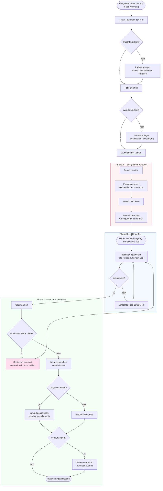
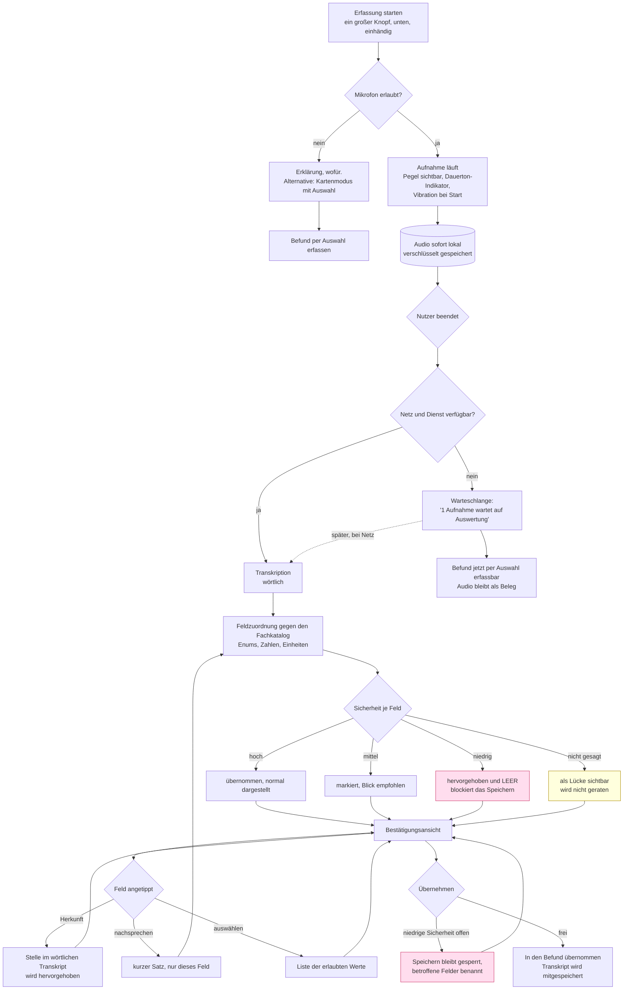
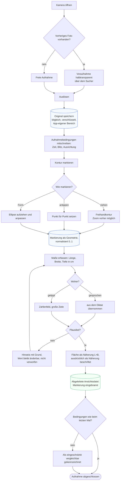
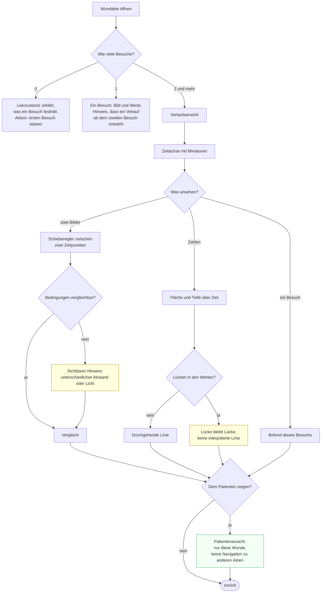
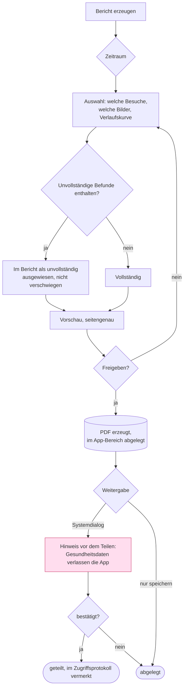

# User Flows — wunddoku

> Ein Flow je tragendem Ablauf, mit Entscheidungspunkten und Fehlerwegen — nicht nur
> dem Glücksfall. Mermaid, damit es versionierbar und diffbar bleibt.

## Der Gedanke, der alle Flows trägt

**Hände und Blick sind zu verschiedenen Zeiten frei.**

| Phase | Situation | Was die App verlangt | Rückmeldung |
|---|---|---|---|
| **A — am offenen Verband** | Handschuhe kontaminiert, beide Hände belegt, Blick auf der Wunde | Fotografieren, sprechen. Sonst nichts. | hörbar und spürbar, **nicht** visuell |
| **B — nach dem Verband** | Handschuhe aus, Hände frei, Patient wird versorgt zurückgelassen | Prüfen und korrigieren | visuell, alles auf einem Bild |
| **C — vor dem Verlassen** | Tasche packen, Verabschiedung | abschließen, ggf. Verlauf zeigen | visuell, kurz |

Die übliche Lösung — Formular mit Mikrofonknopf je Feld — verlangt Blick und
Bedienung genau in Phase A, wo beides nicht verfügbar ist. Deshalb sind Erfassung
und Prüfung hier bewusst **zeitlich getrennt**.

---

## Flow 1 — Besuch dokumentieren (Rahmen)

**Warum das Speichern bei unsicheren Werten blockiert, bei fehlenden aber nicht:**
Eine Lücke sieht man als Lücke. Ein falsch verstandener Wert sieht aus wie ein
richtiger. **Lücke ist erlaubt, Rätsel nicht.**

---

## Flow 2 — Erfassung per Sprache und Rückkopplung

Der eigentliche Entwurfsraum. Nicht die Transkription, sondern was danach passiert.

**Vier Eigenschaften, die das Muster ausmachen:**

1. **Das wörtliche Transkript bleibt und wird gespeichert.** Es ist der Beleg, wenn
   ein Wert später bestritten wird, und der Rückweg bei Zuordnungsfehlern.
2. **Zuordnung ist ein eigener, sichtbarer Schritt** — Vorschlag mit Herkunft, nicht
   Text direkt ins Feld.
3. **Bestätigung vor Übernahme**, alle Felder auf einem Bild.
4. **Korrektur trifft ein Feld**, nie den ganzen Befund.

**Für jede Sprachaktion existiert eine gleichwertige Bedienung ohne Sprache**
(Kartenmodus). Sprache ist die Abkürzung, nicht der einzige Weg — das ist zugleich
die Antwort auf fehlende Mikrofonberechtigung, auf Lärm und auf den Fall, dass der
Patient nicht möchte, dass gesprochen wird.

---

## Flow 3 — Foto, Markierung, Maße

**Drei Artefakte je Aufnahme,** wie in `/eps:bild-erfassung` gefordert: unverändertes
Original, Markierung als normalisierte Geometrie, daraus erzeugte Ansichtsdatei mit
eingebrannter Markierung. Das Briefing verlangt genau das — *„Original + Stiftmarkierung
als eingebrannte Zweitdatei"*.

**Die Fläche wird nicht aus dem Bild gerechnet.** Ohne Maßstab im Bild wäre das eine
erfundene Zahl. Gemessen wird wie heute mit dem Lineal, gesprochen wird der Wert, die
Fläche ist die klinisch übliche Näherung L×B und heißt auch so. Ein Maßstab per
mitfotografiertem Referenzobjekt steht in der Story Map unter „Später" —
als benannte Ausbaustufe, nicht als stille Auslassung.

**Ziehen hat immer eine Alternative** (WCAG 2.5.7): Punkt-für-Punkt-Setzen und eine
aufziehbare Ellipse. Mit Handschuhen ist die Ellipse oft der schnellere Weg.

---

## Flow 4 — Verlauf verstehen

Der eigentliche klinische Wert laut Briefing: *„verlauf soll verstanden werden ob
kleiner größer etc"*.

Zwei Ehrlichkeitsregeln: **keine interpolierte Linie über fehlende Messungen**, und
**Bilder aus zu verschiedenen Aufnahmesituationen werden gekennzeichnet**, statt
kommentarlos nebeneinandergestellt zu werden. Beides sind Stellen, an denen eine
hübsche Darstellung eine Aussage suggerieren würde, die die Daten nicht hergeben.

Die **Patientenansicht** ist kein Beiwerk: Wer dem Patienten den Bildschirm hinhält,
darf dabei nicht die Liste der anderen Patienten zeigen.

---

## Flow 5 — Wundbericht ins Büro

Der Bericht ist der Punkt, an dem der Nutzen für Dritte sichtbar wird — und
gleichzeitig der Punkt, an dem Gesundheitsdaten den geschützten Bereich verlassen.
Deshalb steht dort eine bewusste Bestätigung und ein Eintrag im Zugriffsprotokoll,
kein stiller Systemdialog.

---

## Fehler- und Randwege, die in jedem Flow gelten

| Fall | Verhalten |
|---|---|
| App wird unterbrochen (Anruf, Akku, Zurück) | Autosave nach jedem Feld; Wiedereinstieg an derselben Stelle mit sichtbarem Hinweis, wo es weitergeht |
| Kein Netz | Kein Unterschied im Ablauf. Audio in die Warteschlange, Status in Nutzersprache: „1 Aufnahme wartet auf Auswertung" |
| Mikrofon verweigert | Kartenmodus, gleichwertig bedienbar; Erklärung wofür, nicht bloß „Berechtigung fehlt" |
| Kamera verweigert | Befund ohne Foto möglich, Foto als Lücke sichtbar |
| Speicher voll | Vor der Aufnahme geprüft, nicht danach; Aufnahme wird nicht begonnen, wenn sie nicht gesichert werden kann |
| Auswertung schlägt fehl | Audio bleibt erhalten, Fehler mit Grund und einer Handlung — kein stiller Wiederholungsversuch |
| Gerät verloren | Ruhende Daten verschlüsselt, Zugang gesperrt; siehe `datenschutz-art9.md` |
