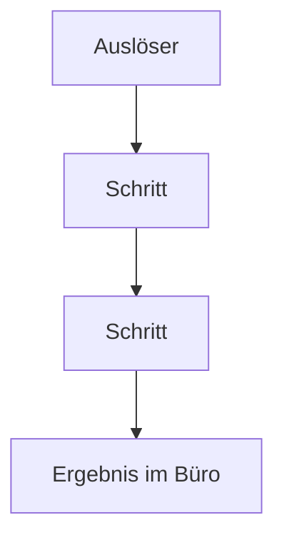

# Ist-Prozess — <Projekt>

> Wie es **heute** läuft, nicht wie es laufen sollte. Grundlage für alles Weitere.

## Beteiligte

| Rolle | Anzahl | Gerät heute | Ort |
|---|---|---|---|

## Ablauf heute

## Schritte im Detail

| # | Schritt | Wer | Wo | Womit | Dauer | Was schiefgeht |
|---|---|---|---|---|---|---|
| 1 | | | | | | |

## Zahlen

- Vorgänge pro Tag / Woche:
- Dauer je Vorgang heute:
- Zeitversatz zwischen Tun und Dokumentieren:
- Nacharbeit pro Woche:
- Fehler, die auffallen — welche und wie oft:

## Reibungspunkte

| Punkt | Kostet | Warum es heute so ist |
|---|---|---|

## Was danach im Büro passiert

_(Bericht, Angebot, Abrechnung, Weitergabe — Format, Empfänger, Auslöser.)_

## Was die App **nicht** ändern soll

_(Was am heutigen Ablauf bewusst bleibt. Verhindert, dass etwas wegdigitalisiert
wird, das einen Grund hat.)_
