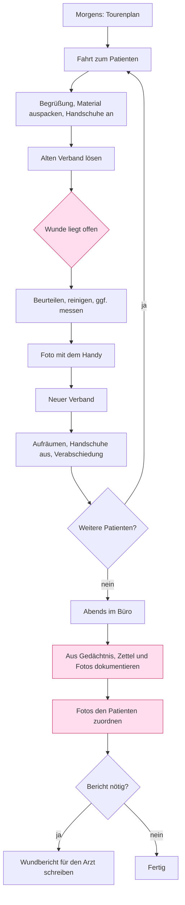

# Ist-Prozess — Ambulante Wundversorgung, Sanitätshaus

> Wie es **heute** läuft, nicht wie es laufen sollte. Grundlage für alles Weitere.
>
> Quelle: Call-Mitschrift und Auditliste des Auftraggebers (`TestProject/projectAudit`).
> Zahlen, die dort nicht stehen, sind unten als **Annahme** gekennzeichnet und in
> `PROGRESS.md` als Frage an den Auftraggeber notiert. Sie werden ersetzt, nicht
> stillschweigend übernommen.

## Beteiligte

| Rolle | Anzahl | Gerät heute | Ort |
|---|---|---|---|
| Pflegekraft ambulante Wundversorgung | 3 | eigenes Smartphone für Fotos, Notizzettel, Einmal-Messlineal | Wohnung des Patienten |
| Büro / Nachdokumentation | dieselben 3 Personen, abends | Desktop-PC | Sanitätshaus |
| Behandelnder Arzt | je Patient | — | Praxis, empfängt Bericht |
| Patient | — | — | eigene Wohnung, meist anwesend und ansprechbar |

Bemerkenswert: Es gibt **keine** getrennte Bürokraft. Wer versorgt, dokumentiert
auch — nur Stunden später. Die Nachdokumentation ist damit Mehrarbeit derselben
Person am Ende eines vollen Tages, nicht Arbeit einer anderen Abteilung.

## Ablauf heute

Rot markiert: die drei Stellen, an denen Information verloren geht.

## Schritte im Detail

| # | Schritt | Wer | Wo | Womit | Dauer | Was schiefgeht |
|---|---|---|---|---|---|---|
| 1 | Tour planen | Pflegekraft | Büro | Liste | 10 min/Tag | — |
| 2 | Verband lösen | Pflegekraft | Wohnung | Hände, Handschuhe | 2–5 min | — |
| 3 | **Wunde beurteilen** | Pflegekraft | Wohnung | Auge, Nase, Lineal | 1–3 min | Nichts wird festgehalten; alles muss ins Gedächtnis |
| 4 | Messen | Pflegekraft | Wohnung | Einmal-Messlineal | <1 min | Wert wird nicht notiert, sondern gemerkt |
| 5 | Fotografieren | Pflegekraft | Wohnung | privates Smartphone | <1 min | Abstand, Winkel und Licht jedes Mal anders; Bild liegt in der privaten Galerie |
| 6 | Neuer Verband | Pflegekraft | Wohnung | Material | 5–10 min | — |
| 7 | Nächster Patient | Pflegekraft | unterwegs | — | — | **Das Gedächtnis wird überschrieben** |
| 8 | Nachdokumentieren | Pflegekraft | Büro, abends | PC | ~10 min je Wunde | Rekonstruktion statt Beobachtung |
| 9 | Fotos zuordnen | Pflegekraft | Büro | Galerie | — | Verwechslung; ähnliche Wunden sehen ähnlich aus |
| 10 | Bericht schreiben | Pflegekraft | Büro | Textverarbeitung | — | Alles ein zweites Mal formulieren |

## Zahlen

Alle Werte **Annahme**, bis der Auftraggeber sie bestätigt oder korrigiert:

- Vorgänge pro Tag: 3–5 Patienten je Tour, teils mehrere Wunden je Patient
- Dauer je Besuch heute: 15–25 min
- **Zeitversatz zwischen Tun und Dokumentieren: mehrere Stunden**, bis zu einem
  ganzen Arbeitstag
- Nacharbeit: ~10 min je Wunde, abends, nach Feierabend der eigentlichen Tour
- Fehler, die auffallen: falsch zugeordnete Fotos, geschätzte statt gemessene Maße,
  fehlende Angaben, die niemandem mehr einfallen

Diese Zahlen sind später der Beleg, ob die App etwas gebracht hat. Ohne sie bleibt
das Erfolgsmaß qualitativ — deshalb stehen sie ganz oben auf der Fragenliste.

## Reibungspunkte

| Punkt | Kostet | Warum es heute so ist |
|---|---|---|
| **Das Zeitfenster ist genau das falsche** | den gesamten Detailreichtum | Die Wunde liegt offen, während beide Hände belegt und die Handschuhe kontaminiert sind. Jedes Werkzeug, das Bedienung verlangt, kollidiert mit der Versorgung. |
| **Flüchtige Merkmale überleben den Tag nicht** | Genauigkeit von Farbe, Exsudatmenge, Geruch, Randbeschaffenheit | Sie sind nicht messbar, nur beobachtbar. Nach vier Stunden und drei Patienten sind sie weg. |
| **Maße aus der Erinnerung** | die Verlaufsaussage | Gemessen wird vor Ort, notiert wird abends. Dazwischen liegt Schätzung. |
| **Fotos ohne Zuordnung und ohne Aufnahmedisziplin** | die Vergleichbarkeit | Privates Handy, wechselnder Abstand und Winkel. Ein Größenvergleich zeigt dann die Kameraführung, nicht die Heilung. |
| **Doppelte Denkarbeit** | ~10 min je Wunde | Einmal beurteilen, einmal formulieren, einmal für den Bericht noch einmal formulieren. |
| **Nachdokumentation ist Freizeit** | Motivation, und damit Vollständigkeit | Der Tag ist zu Ende, die Dokumentation nicht. Was unvollständig bleibt, bleibt unvollständig. |
| **Verlauf existiert nur im Kopf** | den eigentlichen klinischen Wert | Einzelne Einträge, kein Nebeneinander. „Wird es besser?" lässt sich nicht zeigen, nur behaupten. |

Der Auftraggeber hat es in einem Satz gesagt: *„davor paar stunden danach im büro
noch alles dokumentieren"*. Der zu automatisierende Prozess ist nicht das
Dokumentieren — es ist der **Zeitversatz**.

## Was danach im Büro passiert

- **Wunddokumentation** in der Patientenakte — Nachweispflicht, Grundlage für die
  weitere Versorgung
- **Wundbericht als PDF** an den behandelnden Arzt *(Annahme zum Empfänger)* —
  Fachsprache, mit Fotos und Verlauf
- **ICD-10-Diagnose** als Anknüpfung an Abrechnung und Arztkommunikation

Der Bericht ist der Punkt, an dem der Nutzen für Dritte sichtbar wird. Er gehört
deshalb in die erste Ausbaustufe, nicht in „später".

## Was die App **nicht** ändern soll

- **Die Versorgung hat Vorrang.** Die App taktet den Verbandwechsel nicht und
  verlangt nichts zu einem Zeitpunkt, den sie sich selbst aussucht.
- **Die Beurteilung bleibt beim Menschen.** Kein automatisch erkannter Wundgrund,
  keine gerechnete Fläche aus dem Foto ohne Maßstab, keine Diagnosevorschläge. Die
  App hält fest, was die Pflegekraft feststellt — sie stellt nichts fest.
- **Der Patient bleibt Gesprächspartner.** Das Gerät darf sich nicht zwischen
  Pflegekraft und Patient schieben. Deshalb: kurze Blickzeiten, kein Vorlesen von
  Befunden im Raum, unübersehbarer Mikrofonzustand.
- **Das Messen mit dem Lineal bleibt.** Es ist schnell, verlässlich und braucht
  keine Technik. Digitalisiert wird das Notieren, nicht das Messen.
- **Der Papierweg bleibt als Rückfall.** Ein leerer Akku darf keinen Besuch
  ungültig machen.
