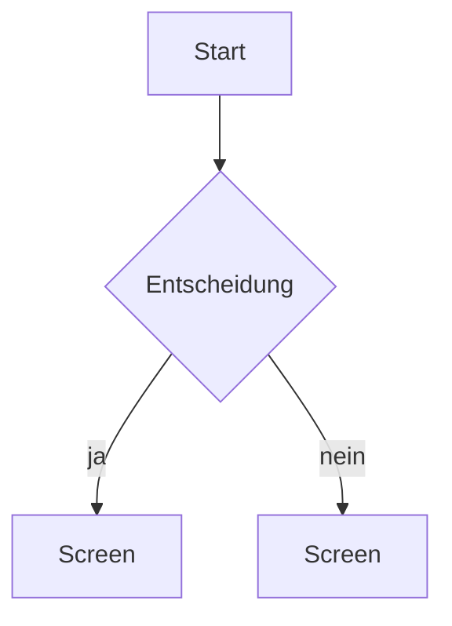

# Screen-Inventar — <Projekt>

> Je Screen alle Zustände. Ein Screen ohne durchdachten Leer- und Fehlerzustand ist
> ein halber Screen.

## Übersicht

| Screen | Route | Zweck in einem Satz | Primäre Aktion |
|---|---|---|---|

## Zustände je Screen

### <Screenname>

| Zustand | Was zu sehen ist | Was der Nutzer tun kann |
|---|---|---|
| leer | | |
| lädt | | |
| gefüllt | | |
| Fehler | | |
| offline | | |
| keine Berechtigung | | |

**Kanten:**
- längster realer Text im Projekt:
- Textskalierung 200 %:
- schmalste Breite 320:

## Flow

