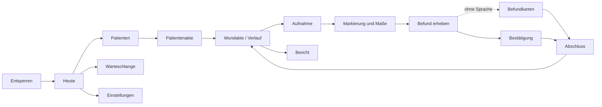

# Screen-Inventar — wunddoku

> Je Screen alle Zustände. Ein Screen ohne durchdachten Leer- und Fehlerzustand ist
> ein halber Screen. Der Leerzustand ist ein Lernort: er erklärt, wofür der Screen
> da ist und was als Nächstes zu tun ist.

## Übersicht

| # | Screen | Route | Zweck in einem Satz | Primäre Aktion | Slice |
|---|---|---|---|---|---|
| 1 | Entsperren | `/` | Zugang zu Gesundheitsdaten sichern, ohne den Einstieg zu verzögern | Entsperren | 2 |
| 2 | Heute | `/heute` | Wer steht heute an, und wo bin ich stehengeblieben | Patient öffnen | 2 |
| 3 | Patienten | `/patienten` | Patient finden oder anlegen | Patient öffnen | 1 |
| 4 | Patient anlegen | `/patienten/neu` | Stammdaten in unter einer Minute | Speichern | 1 |
| 5 | Patientenakte | `/patienten/:id` | Alle Wunden dieses Patienten mit ihrem Stand | Wunde öffnen | 1 |
| 6 | Wunde anlegen | `/patienten/:id/wunden/neu` | Wunde verorten und benennen | Speichern | 1 |
| 7 | Wundakte / Verlauf | `/wunden/:id` | Wird es besser oder schlechter | Besuch starten | 1 |
| 8 | Aufnahme | `/besuch/:id/foto` | Vergleichbares Foto machen | Auslösen | 1 |
| 9 | Markierung und Maße | `/besuch/:id/markierung` | Wunde im Bild verorten und vermessen | Weiter | 1 |
| 10 | Befund erheben | `/besuch/:id/befund` | Befund festhalten, ohne hinzusehen | Sprechen | 1 |
| 11 | **Bestätigung** | `/besuch/:id/pruefen` | Sehen, was verstanden wurde, und einzeln korrigieren | Übernehmen | 1 |
| 12 | Befundkarten | `/besuch/:id/karten` | Gleichwertige Erfassung ohne Sprache | Feld wählen | 1 |
| 13 | Besuch abschließen | `/besuch/:id/abschluss` | Kreis schließen, Lücken sichtbar machen | Abschließen | 1 |
| 14 | Bericht | `/wunden/:id/bericht` | Befunde für den Arzt zusammenstellen | Freigeben | 1 |
| 15 | Warteschlange | `/warteschlange` | Was wartet noch auf Auswertung, und warum | Erneut versuchen | 2 |
| 16 | Einstellungen | `/einstellungen` | Mikrofon, Aufbewahrung, Löschpfade, Protokoll | — | 2 |

Screen 11 ist der Screen, an dem dieses Projekt hängt. Er bekommt entsprechend die
meiste Aufmerksamkeit.

---

## Zustände je Screen

### 11 — Bestätigung *(Kernscreen)*

Eine Zeile je Feld: Bezeichnung, vorgeschlagener Wert, Sicherheitsgrad, Ursprung im
Transkript. Bedienbar mit Handschuhen, also große Zeilen und großzügige Trefferflächen.
Sortierung: **was Aufmerksamkeit braucht, steht oben** — unsicher, dann Lücke, dann
geprüft. Nicht in Formularreihenfolge.

| Zustand | Was zu sehen ist | Was der Nutzer tun kann |
|---|---|---|
| leer | Kommt nicht ohne Erfassung vor. Direktaufruf zeigt: „Noch nichts erfasst" mit Weg zurück zur Erfassung | zurück zur Erfassung, Kartenmodus |
| lädt | Transkript ist schon da und wird wörtlich angezeigt; Feldzuordnung baut sich Zeile für Zeile auf | Transkript lesen, abbrechen |
| gefüllt | Alle Felder mit Wert, Sicherheit und Herkunft; Kopfzeile fasst zusammen: „7 übernommen · 2 prüfen · 3 fehlen" | Feld antippen → Herkunft / nachsprechen / auswählen; Übernehmen |
| unsichere Werte offen | Betroffene Felder hervorgehoben und **leer**; Übernehmen-Knopf gesperrt mit Begründung, welche Felder blockieren | Feld entscheiden — kein Weg vorbei |
| Fehler | Auswertung fehlgeschlagen, Grund im Klartext; Audio ist erhalten und wird benannt | erneut auswerten, Kartenmodus, Audio anhören |
| offline | Hinweis: Auswertung wartet auf Netz; Audio liegt sicher; Kartenmodus angeboten | Kartenmodus, später auswerten |
| keine Berechtigung | entfällt (Mikrofon wird auf Screen 10 geklärt) | — |

**Sicherheitsgrade in der Darstellung** — Farbe ist nie das einzige Merkmal:

| Sicherheit | Darstellung | Verhalten |
|---|---|---|
| hoch | normal, Häkchen | keine Aktion nötig |
| mittel | Randmarkierung + Symbol „prüfen" | übernehmbar, Blick empfohlen |
| niedrig | hervorgehoben, Wert **leer**, Symbol „entscheiden" | **blockiert das Speichern** |
| nicht gesagt | gestrichelte Lücke, Wort „fehlt" | bleibt leer, wird nicht geraten |

**Kanten:**
- längster realer Text: „Osteo-Arthropathie" im Feldnamen, „lokale und systemische
  Schmerztherapie" als Kartenname, ICD-10-Bezeichnungen bis ~80 Zeichen
- Textskalierung 200 %: Zeile bricht auf zwei Zeilen um, Trefferfläche wächst mit,
  Sicherheitssymbol bleibt links neben dem Feldnamen
- schmalste Breite 320: Wert rückt unter den Feldnamen, Symbol bleibt sichtbar
- Screenreader: Ergebnis wird als `liveRegion` angekündigt („9 Felder erkannt, 2 zu
  prüfen"), Sicherheit steht im `semanticsLabel`, nicht nur in der Farbe

---

### 10 — Befund erheben

Der Screen, den die Pflegekraft **nicht ansieht**. Er ist so gebaut, dass er ohne
Blick bedienbar ist: ein großer Knopf im unteren Erreichbarkeitsbereich, Vibration
bei Start und Stopp, hörbare Quittung bei erkanntem Feld.

| Zustand | Was zu sehen ist | Was der Nutzer tun kann |
|---|---|---|
| leer | Erklärt in einem Satz, was gesprochen werden kann, mit zwei Beispielsätzen aus dem echten Vokabular | Aufnahme starten, Kartenmodus wählen |
| lädt | entfällt — die Aufnahme beginnt sofort | — |
| gefüllt (Aufnahme läuft) | Großer Pegel, mitlaufende Dauer, unübersehbarer Aufnahmezustand; live erkannte Feldnamen als Häkchenliste (Blick optional, nicht nötig) | beenden, abbrechen |
| Fehler | Aufnahme nicht möglich (Mikrofon belegt, Speicher voll) mit Grund und Ausweg | Kartenmodus |
| offline | kein Unterschied — Aufnahme läuft, Auswertung wandert in die Warteschlange; Hinweis nach dem Beenden | weiter wie sonst |
| keine Berechtigung | Erklärt, wofür das Mikrofon gebraucht wird und was ohne es geht; Kartenmodus als gleichwertiger Weg angeboten, nicht als Notlösung | Berechtigung erteilen, Kartenmodus |

**Kanten:** Aufnahmezustand ist sichtbar **und** spürbar **und** hörbar — in einer
fremden Wohnung darf ein laufendes Mikrofon nicht übersehen werden (JS-8). Das Ende
ist eindeutig quittiert. Es gibt keinen Hintergrundstart und kein Dauerlauschen.

---

### 8 — Aufnahme

| Zustand | Was zu sehen ist | Was der Nutzer tun kann |
|---|---|---|
| leer | Erster Besuch: Sucher ohne Geisterbild, Hinweis, dass ab dem zweiten Besuch eine Aufnahmehilfe erscheint | auslösen |
| lädt | Kamera startet | — |
| gefüllt | Sucher mit halbtransparenter Voraufnahme, Deckkraft regelbar, Auslöser groß und unten | auslösen, Geisterbild ein/aus |
| Fehler | Kamera nicht verfügbar, Grund im Klartext | ohne Foto fortfahren |
| offline | kein Unterschied | — |
| keine Berechtigung | erklärt wofür; Befund ohne Foto ist möglich und die Lücke wird später sichtbar | Berechtigung erteilen, ohne Foto weiter |

---

### 9 — Markierung und Maße

| Zustand | Was zu sehen ist | Was der Nutzer tun kann |
|---|---|---|
| leer | Foto ohne Markierung, drei Werkzeuge nebeneinander: Ellipse, Punkte, Freihand | markieren, überspringen |
| lädt | Bild wird geladen, EXIF-Rotation angewandt | — |
| gefüllt | Kontur über dem Bild, Maßfelder darunter, Fläche als **Näherung** beschriftet | Kontur ändern, Strich zurücknehmen, Maße sprechen oder tippen |
| Fehler | Bild nicht lesbar | erneut aufnehmen |
| offline | kein Unterschied | — |
| keine Berechtigung | entfällt | — |

**Kanten:** Markierung sitzt nach Zoom, Pan, Drehung und Neuladen richtig (normalisierte
Koordinaten, Golden-Test bei zwei Zoomstufen). Zeichnen und Verschieben sind getrennte
Modi, sonst malt jeder Verschiebeversuch eine Linie. Rückgängig arbeitet je Strich,
nicht je Punkt.

---

### 7 — Wundakte / Verlauf

| Zustand | Was zu sehen ist | Was der Nutzer tun kann |
|---|---|---|
| leer (0 Besuche) | Erklärt, was ein Besuch festhält und wofür der Verlauf gut ist; ein Knopf: ersten Besuch starten | Besuch starten |
| ein Besuch | Bild und Werte des einen Besuchs, Hinweis, dass der Vergleich ab dem zweiten entsteht | Besuch starten |
| gefüllt | Zeitachse mit Miniaturen, Schieberegler zwischen zwei Zeitpunkten, Kurve für Fläche und Tiefe | vergleichen, Besuch öffnen, dem Patienten zeigen |
| eingeschränkt vergleichbar | Wie gefüllt, zusätzlich ein benannter Hinweis an den betroffenen Aufnahmen | trotzdem vergleichen |
| Fehler | Bild fehlt oder ist beschädigt — Platzhalter mit Grund, restliche Daten bleiben nutzbar | Besuch öffnen |
| offline | kein Unterschied, alles lokal | — |
| keine Berechtigung | entfällt | — |

**Kanten:** Lücken in der Messreihe werden **nicht** interpoliert. Die Patientenansicht
blendet Navigation zu anderen Akten aus.

---

### 13 — Besuch abschließen

| Zustand | Was zu sehen ist | Was der Nutzer tun kann |
|---|---|---|
| vollständig | Zusammenfassung, grüner Abschluss, Angebot den Verlauf zu zeigen | abschließen, Verlauf zeigen |
| unvollständig | Liste der fehlenden Angaben, jede antippbar; Abschluss **möglich**, Befund wird als unvollständig geführt | Lücke füllen, trotzdem abschließen |
| unsicheres offen | Abschluss gesperrt mit Nennung der betroffenen Felder | zur Bestätigung zurück |
| offline | Hinweis, dass die Auswertung noch aussteht, Besuch trotzdem abschließbar | abschließen |

Der Unterschied zwischen den Zeilen zwei und drei ist die zentrale Regel dieses
Projekts: **eine Lücke darf mitgehen, ein unklarer Wert nicht.**

---

### 3 / 5 — Patienten und Patientenakte

| Zustand | Was zu sehen ist | Was der Nutzer tun kann |
|---|---|---|
| leer | „Noch keine Patienten." Erklärt in einem Satz, dass eine Akte Wunden und deren Verlauf bündelt | Patient anlegen |
| lädt | Skelettzeilen | — |
| gefüllt | Liste mit Name, offener Wunde, Datum des letzten Besuchs; Suche oben | öffnen, anlegen, suchen |
| Suche ohne Treffer | „Kein Patient zu ‚…'" mit dem Suchbegriff und dem Angebot, ihn anzulegen | anlegen, Suche ändern |
| Fehler | Datenbank nicht lesbar (z. B. gesperrt) mit Grund | erneut, Entsperren |
| offline | kein Unterschied | — |
| keine Berechtigung | Akte gehört einer anderen Pflegekraft: Hinweis statt Inhalt | zurück |

---

## Navigationsstruktur

Der Besuch ist ein **linearer Korridor** mit vier Stationen. Das ist Absicht: unter
Zeitdruck und mit Handschuhen ist eine feste Reihenfolge schneller als eine freie
Navigation, und der Wiedereinstieg nach einer Unterbrechung ist eindeutig.

## Durchgehende Anforderungen an jeden Screen

- Primäre Aktion im unteren Erreichbarkeitsbereich, einhändig erreichbar
- Tippziele **≥ 48 dp** — Untergrenze, nicht Ziel; WCAG 2.2 SC 2.5.8 verlangt 24×24
  CSS-Pixel, die Plattformvorgabe ist strenger und bleibt die Messlatte
- Zerstörende Aktionen bewusst **außerhalb** des Daumenbereichs
- Autosave nach jedem Feld, Wiedereinstieg an derselben Stelle
- Getestet bei den Breiten 320, 375, 768, 1024 und bei Textskalierung 200 %
- Fokus wird in langen Formularen nicht verdeckt (WCAG 2.4.11)
- Kein personenbezogener Inhalt in Fehlermeldungen, Logs oder Screenshots
